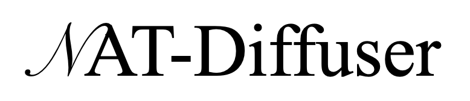
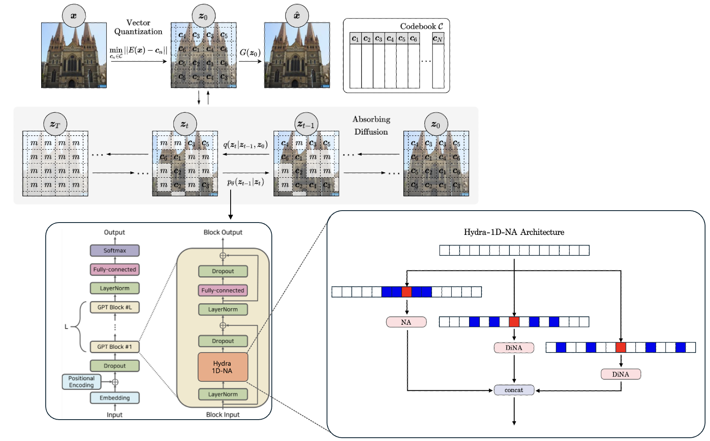
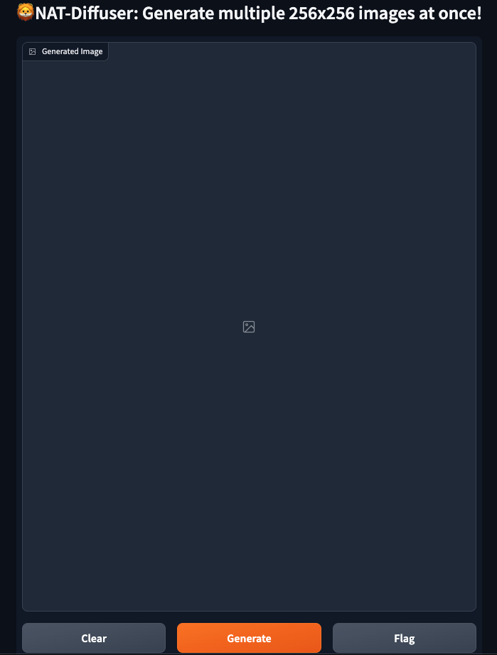

## NAT-Diffuser : Discrete Absorbing Diffusion Meets Neighborhood Attnetion Transformers at Vector-Quantized Space


<p align="center">
    
</p>


<div align="center">
    2024.04.24 ~ 2024.06.14
</div>


<div align="center">
    <a href="">Report(coming soon)</a> | 
    <a href="">PPT(coming soon)</a>
</div>


<br>

<p align="center">
    
</p>


**NAT-Diffuser** is the discrete absorbing diffusion model whose denoising function is GPT with **Hydra-1D-NA** module. It is able to generate high-fidelity images from the vector-quantized code space.

Both discrete diffusion and VQ-GAN models are verified to be trainable with ```batch_size 4``` on single NVIDIA RTX ..60Ti - even on Colab GPU with lower batch size. 

Furthermore, you can even make diffusion model faster via customizing the configurations of **Hydra-1D-NA** module, which leads to improvement in both train and inference time.


## News 🚀

<p align="center">
    
</p>

Web demo is now available with your own checkpoints!

## Setup


### Set up conda environment

To run the code in this repository we recommend you set up a virtual environment using [conda](https://docs.conda.io/en/latest/). To get set up quickly, use [miniconda](https://docs.conda.io/en/latest/miniconda.html).

Run the following command to clone this repo using [git](https://git-scm.com/book/en/v2/Getting-Started-Installing-Git) and create and activate the conda environment `natdiff`:

```
git clone https://github.com/justin4ai/NAT-Diffuser.git && cd NAT-Diffuser
conda create --name natdiff --file requirements.yml
conda activate natdiff  
pip install rotary-embedding-torch
```


Additionally, you need to install ```natten``` package for applying faster neighborhood attention (**HydraNeighborhoodAttention** module) compared to naive implementation. Please go to [NATTEN](https://shi-labs.com/natten/) homepage and install the natten version that matches to your environment.

For example, I overrided pytorch version of my conda environment in H100 machine via

```
pip install torch==2.2.0 torchvision==0.17.0 torchaudio==2.2.0 --index-url https://download.pytorch.org/whl/cu121
```

which corresponds to torch 2.2.x and CUDA 12.1. Then

```
pip3 install natten==0.17.1+torch220cu121 -f https://shi-labs.com/natten/wheels/
```

should work for your enviroment.

You should now be able to run all commands available in the following sections.

### Dataset Setup
To configure the default paths for datasets used for training the models in this repo, simply edit `datasets.yaml` - changing the `paths` attribute of each dataset you wish to use to the path where your dataset is saved locally.


| Dataset | Official Link                                           | Academic Torrents Link |
| ------- | --------------------------------------------------------|------------------------|
| FFHQ    | [Official FFHQ](https://github.com/NVlabs/ffhq-dataset) | [Academic Torrents FFHQ](https://academictorrents.com/details/1c1e60f484e911b564de6b4d8b643e19154d5809) |
| LSUN    | [Official LSUN](https://github.com/fyu/lsun)            | [Academic Torrents LSUN](https://academictorrents.com/details/c53c374bd6de76da7fe76ed5c9e3c7c6c691c489) |

In this project, we used dataset from [140k Real and Fake Faces](https://www.kaggle.com/datasets/xhlulu/140k-real-and-fake-faces?select=train.csv) for Deepfake Detection Challenge in Kaggle. Note there are 50k real iamges among 140k.

### Pre-Trained Models
Pre-trained models can be found [here](https://drive.google.com/drive/folders/1DhgimU0onrKb4codFH_5PzJ0K6RpWssE?usp=sharing). With checkpoints trained on various datasets provided by Unleashing Transformer author, we also provide some more pre-trained models on the **140k Real and Fake Faces**. 

```
.
├── logs
│   ├── absorbing_ffhq
│   │   └── saved_models
│   │       └── absorbing_125000.th
│   └── vqgan_ffhq
│       └── saved_models
│           └── vqgan_ema_1225000.th
├── logs_pretrained
│   ├── absorbing_bedrooms
│   │   └── saved_models
│   │       └── absorbing_ema_2000000.th
│   ├── absorbing_churches
│   │   └── saved_models
│   │       └── absorbing_ema_2000000.th
│   ├── absorbing_ffhq
│   │   └── saved_models
│   │       └── absorbing_ema_900000.th
│   ├── vqgan_bedrooms
│   │   └── saved_models
│   │       └── vqgan_ema_2200000.th
│   ├── vqgan_churches
│   │   └── saved_models
│   │       └── vqgan_ema_2200000.th
│   └── vqgan_ffhq
│       └── saved_models
│           └── vqgan_ema_1400000.th
└── sample_ffhq.sh
```

Note the checkpoints under ```log``` folder are trained on 5k real images from **140k Real and Fake Faces** by us.


## Commands
If your GPU has less VRAM than a 2080 Ti then you may need to train using smaller batch sizes and/or smaller models than the defaults.

For a detailed list of all commands options, including altering model architecture, logging output, checkpointing frequency, etc., please add the `--help` flag to the end of your command.

### Inference

Simply running the following command will let you get some inference results. Note you need pre-trained VQ-GAN and absorbing diffusion checkpoints.

```
bash sample_ffhq.sh
```

### Web Demo

Gradio demo is also supported.

```
python3 demo.py --sampler absorbing --dataset ffhq --log_dir ffhq_samples --temp 0.8 --ae_load_dir vqgan_ffhq --ae_load_step {VQGAN_STEPS} --load_dir pretrained_samplers --load_step {ABSORBING_STEPS} --ema --sample_steps 256 --num_samples 16
```

Note only ```--num_samples 1``` or ```16``` is available for now. I am working on adding some more features.

### Set up visdom server

Before training, you'll need to start a visdom server in order to easily view model output (loss graphs, reconstructions, etc.). To do this, run the following command:

```
visdom -p 8097
```

This starts a visdom server listening on port 8097, which is the default used by our models. If you navigate to localhost:8097 you will see be able to view the live server.

To specify a different port when training any models, use the `--visdom_port` flag.

### Train a Vector-Quantized autoencoder on FFHQ

The following command starts the training for a VQGAN on LSUN Churches: 
```
python3 train_vqgan.py --dataset ffhq --log_dir vqgan_ffhq --amp --ema --batch_size 4 --diff_aug
```

As specified with the `--log_dir` flag, results will be saved to the directory `logs/vqae_ffhq`. This includes all logs, model checkpoints and saved outputs. The `--amp` flag enables mixed-precision training, necessary for training using a batch size of 4 (the default) on a single 2080 Ti.

### Train an Absorbing Diffusion sampler using the above Vector-Quantized autoencoder

After training the VQ model using the previous command, you'll be able to run the following commands to train a discrete diffusion prior on the latent space of the Vector-Quantized model:

```
python3 train_sampler.py --sampler absorbing --dataset ffhq --log_dir absorbing_ffhq --ae_load_dir vqgan_ffhq --ae_load_step 2200000 --amp --ema
```

The sampler needs to load the trained Vector-Quantized autoencoder in order to generate the latents it will use as for training (and validation). Latents are cached after the first time this is run to speed up training.

### Experiments on trained Absorbing Diffusion Sampler

This section contains simple template commands for calculating metrics and other experiments on trained samplers.

**Calculate FID**

```
python experiments/calc_FID.py --sampler absorbing --dataset churches --log_dir FID_log --ae_load_dir vqgan_churches --ae_load_step 2200000  --load_dir absorbing_churches --load_step 2000000 --ema --n_samples 50000 --temp 0.9
```

**Calculate DINOv2-ViT-L/14** 

According to [Exposing Flaws](https://arxiv.org/abs/2306.04675), FID score doens't reflect the fidelity of generated images, especially by diffusion models. The paper authors figured out DINOv2-ViT-L/14 is an alternative towards better evaluation for human perception. This code will be released as a separate repository soon.


<!-- **Calculate PRDC Scores**

```
python experiments/calc_PRDC.py --sampler absorbing --dataset churches --log_dir PRDC_log --ae_load_dir vqgan_churches --ae_load_step 2200000 --load_dir absorbing_churches --load_step 2000000 --ema --n_samples 50000
``` -->


<!-- **Calculate ELBO Estimates**

The following command fine-tunes a Vector-Quantized autoencoder to compute reconstruction likelihood, and then evaluates the ELBO of the overall model.

```
python experiments/calc_approximate_ELBO.py --sampler absorbing --dataset ffhq --log_dir nll_churches --ae_load_dir vqgan_churches --ae_load_step 2200000 --load_dir absorbing_churches --load_step 2000000 --ema --steps_per_eval 5000 --train_steps 10000
```

NOTE: the `--steps_per_eval` flag is required for this script, as a validation dataset is used.  -->


<!-- **Find Nearest Neighbours**

Produces a random batch of samples and finds the nearest neighbour images in the training set based on LPIPS distance.

```
python experiments/calc_nearest_neighbours.py --sampler absorbing --dataset churches --log_dir nearest_neighbours_churches --ae_load_dir vqgan_churches --ae_load_step 2200000 --load_dir absorbing_churches --load_step 2000000 --ema
``` -->

**Generate Higher Resolution Samples**

By applying the absorbing diffusion model to various locations at once and aggregating denoising probabilities, larger samples than observed during training are able to be generated (see Figures 4 and 11).

```
python experiments/generate_big_samples.py --sampler absorbing --dataset churches --log_dir big_samples_churches --ae_load_dir vqgan_churches --ae_load_step 2200000 load_dir absorbing_churches --load_step 2000000 --ema --shape 32 16
```

Use the `--shape` flag to specify the dimensions of the latents to generate.

## References

The code for this project heavily depends on [Unleashing Transformers](https://github.com/samb-t/unleashing-transformers) for discrete absorbing diffusion. Most of changes have been made with the help of [NATTEN](https://github.com/SHI-Labs/NATTEN) package for runtime improvement.

Also I appreciate the help of [StyleNAT](https://github.com/SHI-Labs/StyleNAT) author in understanding Hydra-NA module.


## To-Do

- [x] **Release Inference Code of absorbing diffusion models.**
- [x] **Release Pre-trained weights of VQ-GAN and aborbing diffusion models.**
- [x] **Release Training Code of VQ-GAN and absorbing diffusion models.**
- [x] **Release Gradio Demo.**
- [x] **Release Evaluation Code for calculating FID.**
- [ ] Release Google Colab.
- [ ] Release Evaluation Code for calculating DINOv2-ViT-L/14.
      


## Citation

```
@Junyeong J. Ahn | Dept. of Data Science, Hanyang University
```